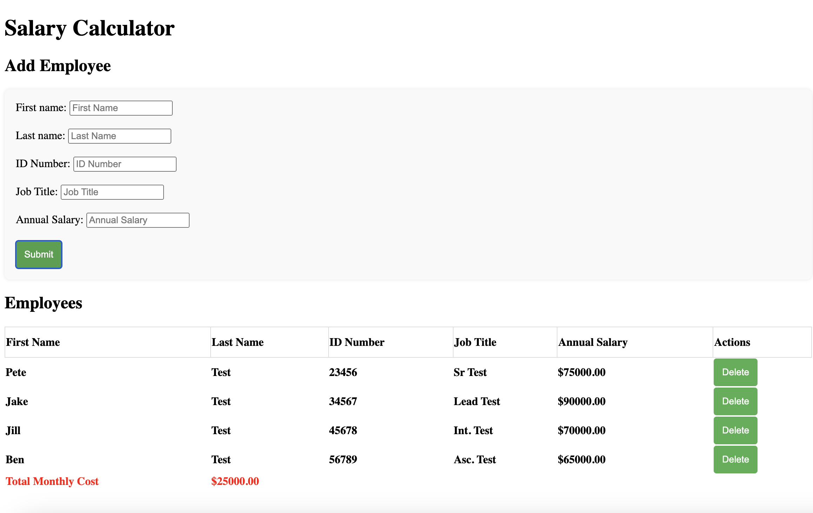

# Project Name: SALARY CALCULATOR

## Description

This application uses a form with five inputs to collect employee data and calculate annual salary, to determine total monthly cost. This calculator provides a clear indication in the footer element to provide clear visualation of when the total monthly cost exceeds the $20,000 threshold by turning the text to a bright red color. The functional delete button allows users to delete specific employees and their data from the form.

## Screenshot of Calculator:

Installation:
After you've cloned this repository, you'll need to:
Run cd weekend-salary-calculator to get "inside" the project directory.
Run npm install to install the libraries that the project relies on.
In the project folder, run npm init --yes, then Install express via npm install express.

Server:
This project uses PORT 5001 which is already set up in the server.js file. To run start this server you can use npm start.

Stopping a Node Server:
Press ctrl-c in terminal to stop the server.

To stop ALL Node servers running on your computer, you can type killall node in terminal.
